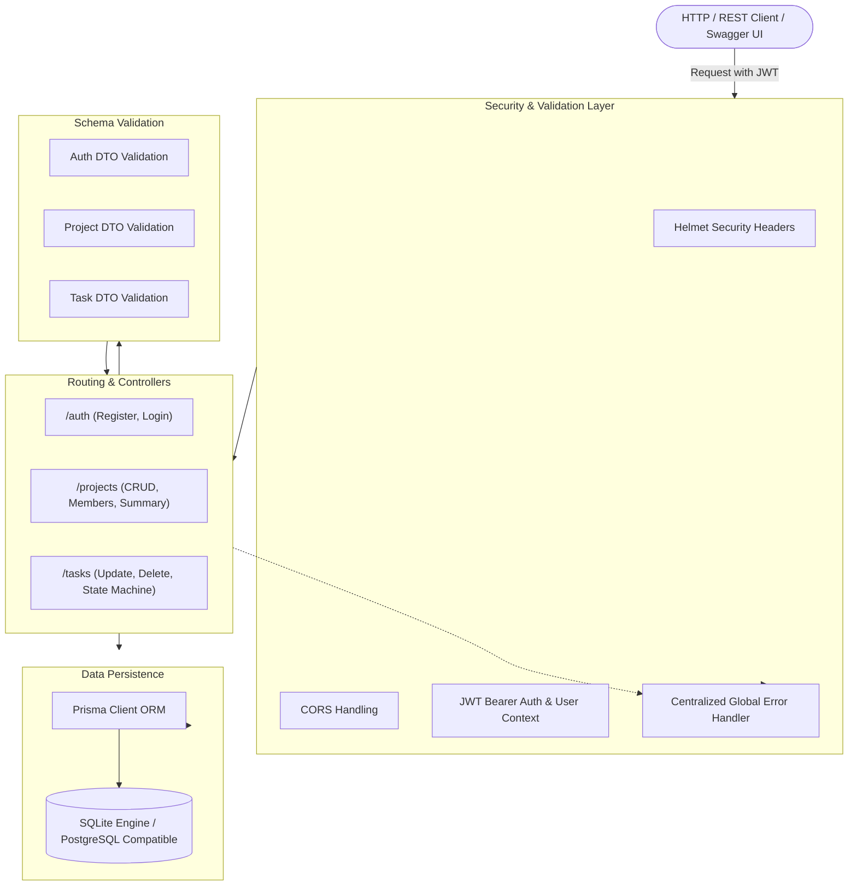
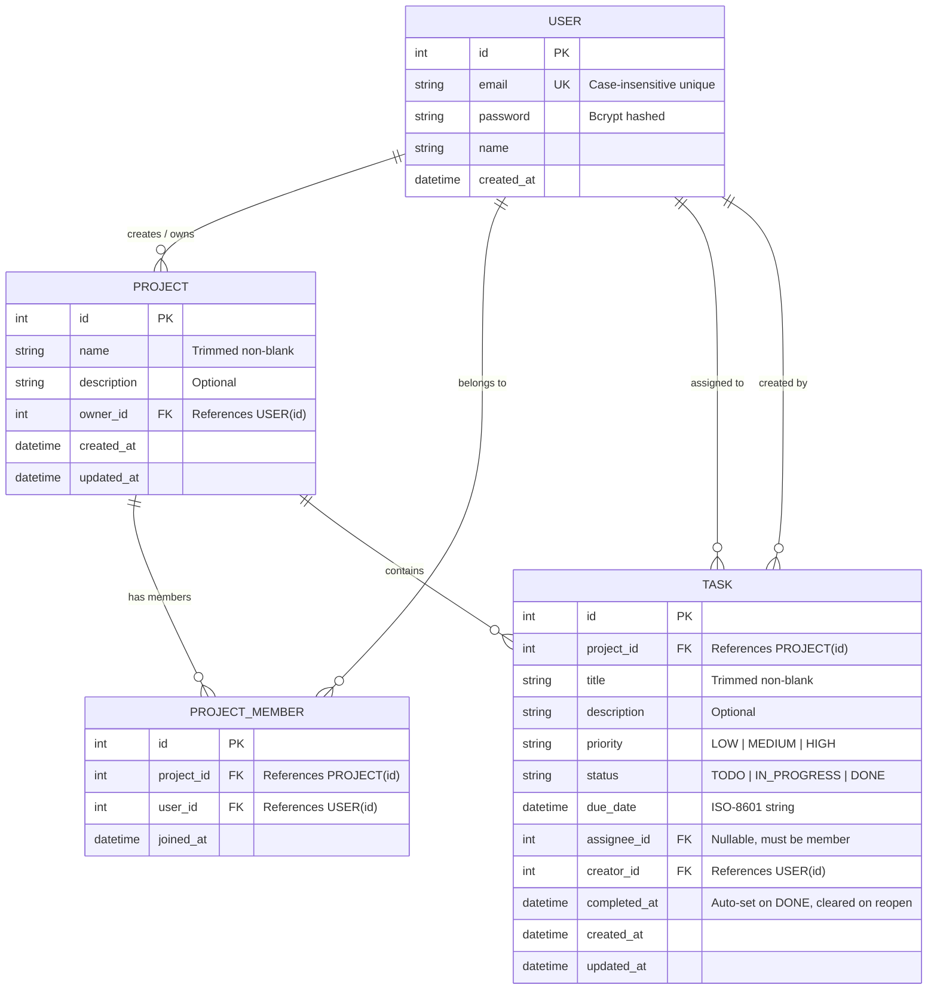

# ⚡ Axionix Team Task Tracker API

[](https://github.com/Amanbhatti008/axionix-task-tracker-api/actions)
[](https://www.typescriptlang.org/)
[](https://nodejs.org/)
[](https://expressjs.com/)
[](https://www.prisma.io/)
[](https://www.sqlite.org/)
[](https://jestjs.io/)
[](http://localhost:3000/api-docs)
[](https://www.docker.com/)

> **A production-minded, multi-tenant Team Task Management REST API built with Node.js, Express, TypeScript, Prisma ORM, and comprehensive Zod validation.**

Developed for the **Axionix Backend Engineering Internship Programme**. Designed with strict separation of concerns, defensive validation, granular role-based authorization, automated lifecycle triggers, and complete OpenAPI/Swagger documentation.

---

## 🎬 Live Interactive Walkthrough


*Automated end-to-end execution of user authentication, JWT authorization, project workspaces, task state machine transitions, and real-time metrics aggregation.*

---

## 📑 Table of Contents

- [System Architecture](#-system-architecture)
- [Database Model & ER Diagram](#-database-model--er-diagram)
- [Key Features & Business Logic](#-key-features--business-logic)
- [API Contract & Reference Matrix](#-api-contract--reference-matrix)
- [Standardized Error Contract](#-standardized-error-contract)
- [Getting Started](#-getting-started)
  - [Native Local Setup](#option-a-native-local-setup-recommended)
  - [Docker Compose Deployment (Bonus)](#option-b-docker-compose-deployment-bonus)
- [Interactive API Documentation (Swagger)](#-interactive-api-documentation-swagger)
- [Automated Testing Suite](#-automated-testing-suite)
- [Architectural Decision Records (ADR)](#-architectural-decision-records-adr)
- [Deliverables & Submission Compliance](#-deliverables--submission-compliance)

---

## 🏛 System Architecture

The service adheres to a modular, layered clean-architecture pattern separating HTTP transport, security middleware, validation schemas, controllers, and database access layers:



---

## 🗄 Database Model & ER Diagram

Relational integrity is maintained via foreign-key constraints, cascade deletions for child records, and strict unique indices.



---

## 🎯 Key Features & Business Logic

1. **Enterprise Authentication**:
   - Case-insensitive email normalization and collision detection.
   - High-entropy password hashing with `bcrypt` (10 rounds). Passwords never leave the database layer.
   - Stateless, cryptographically signed JSON Web Tokens (JWT) with configurable TTL.

2. **Multi-Tenant Project Isolation**:
   - Dynamic membership checks on all project and task operations.
   - Non-members are strictly forbidden (`403 FORBIDDEN` or `404 NOT FOUND`) from querying or modifying tasks.
   - Project creators are automatically added to the project members registry as owners.
   - Only the designated project owner can enroll members or destroy the project.

3. **Stateful Task Lifecycle Machine**:
   - **Status Transitions**: `TODO` ⇄ `IN_PROGRESS` ⇄ `DONE`.
   - **`completed_at` Lifecycle Trigger**: Automatically recorded as an ISO-8601 timestamp whenever status transitions to `DONE`. If reopened to `TODO` or `IN_PROGRESS`, the timestamp is atomically wiped to `null`.
   - **Assignee Guard**: Assignees are strictly validated against active project members. Non-members cannot be assigned (`400 BAD REQUEST`).
   - **Deletion Authorization**: Strictly restricted to either the project owner or the original task creator.

4. **Advanced Querying & Aggregation**:
   - **Bounded Pagination**: Default 10 items/page, enforced maximum of 50 items/page to prevent DoS.
   - **Multi-Vector Filtering**: Filter tasks concurrently by `status`, `priority`, `assignee_id`, and `due_date` range (`due_date_from` and `due_date_to`).
   - **Sorting**: Order by `created_at` or `due_date` in either `asc` or `desc`.
   - **Project Metrics Summary**: Real-time aggregation of total project task counts broken down into status and priority matrix.

---

## 📡 API Contract & Reference Matrix

| Method | Endpoint | Description | Auth Required | Permissions |
| :--- | :--- | :--- | :---: | :--- |
| `POST` | `/auth/register` | Register a new user | ❌ Public | Unauthenticated |
| `POST` | `/auth/login` | Authenticate user & issue JWT | ❌ Public | Unauthenticated |
| `POST` | `/projects` | Create a new project workspace | ✅ Bearer | Authenticated User |
| `GET` | `/projects` | List projects where user is a member/owner | ✅ Bearer | Authenticated User |
| `GET` | `/projects/{id}` | Retrieve details of a specific project | ✅ Bearer | Project Member |
| `POST` | `/projects/{id}/members` | Add member by email | ✅ Bearer | Project Owner Only |
| `DELETE` | `/projects/{id}` | Delete project and cascade all tasks | ✅ Bearer | Project Owner Only |
| `POST` | `/projects/{id}/tasks` | Create task within project | ✅ Bearer | Project Member |
| `GET` | `/projects/{id}/tasks` | List paginated, filtered, sorted tasks | ✅ Bearer | Project Member |
| `GET` | `/projects/{id}/summary` | Status & priority task metrics summary | ✅ Bearer | Project Member |
| `PATCH` | `/tasks/{id}` | Partially update task fields/status | ✅ Bearer | Project Member |
| `DELETE` | `/tasks/{id}` | Delete task | ✅ Bearer | Owner or Creator Only |

### Example cURL Requests

<details>
<summary><b>1. Register User</b></summary>

```bash
curl -X POST http://localhost:3000/auth/register \
  -H "Content-Type: application/json" \
  -d '{
    "name": "Aman Bhatti",
    "email": "aman@example.com",
    "password": "SecurePassword123!"
  }'
```
</details>

<details>
<summary><b>2. Authenticate & Obtain Token</b></summary>

```bash
curl -X POST http://localhost:3000/auth/login \
  -H "Content-Type: application/json" \
  -d '{
    "email": "aman@example.com",
    "password": "SecurePassword123!"
  }'
```
</details>

<details>
<summary><b>3. Filter Tasks with Pagination</b></summary>

```bash
curl -X GET "http://localhost:3000/projects/1/tasks?status=IN_PROGRESS&priority=HIGH&page=1&limit=10&sortBy=due_date&sortOrder=asc" \
  -H "Authorization: Bearer <YOUR_JWT_TOKEN>"
```
</details>

---

## 🛡 Standardized Error Contract

All system failures, validation errors, and unauthorized actions adhere to an immutable JSON error shape:

```json
{
  "error": {
    "code": "FORBIDDEN",
    "message": "Only the project owner can add new members"
  }
}
```

| HTTP Status | Error Code | Trigger Condition |
| :--- | :--- | :--- |
| `400 Bad Request` | `VALIDATION_ERROR` | Malformed request body, blank title, invalid enum, non-member assignee |
| `401 Unauthorized` | `UNAUTHORIZED` | Missing, malformed, or expired JWT token |
| `403 Forbidden` | `FORBIDDEN` | Member attempting owner-only operation or non-creator deleting task |
| `404 Not Found` | `NOT_FOUND` | Resource does not exist or user lacks visibility |
| `409 Conflict` | `CONFLICT` | User with the requested email already exists |
| `500 Server Error` | `INTERNAL_SERVER_ERROR` | Unhandled runtime exception |

---

## 🚀 Getting Started

### Option A: Native Local Setup (Recommended)

#### Prerequisites
- Node.js >= 18.x
- npm >= 9.x

```bash
# 1. Clone repository
git clone https://github.com/Amanbhatti008/axionix-task-tracker-api.git
cd axionix-task-tracker-api

# 2. Install dependencies
npm install

# 3. Environment configuration
cp .env.example .env

# 4. Generate Prisma artifacts & initialize SQLite database
npm run db:push

# 5. Start dev server with hot reload
npm run dev
```
The API is now running at `http://localhost:3000`!

---

### Option B: Docker Compose Deployment (Bonus)

Deploy the complete containerized stack in one command:

```bash
docker compose up -d --build
```
Verify the container health:
```bash
docker compose ps
```

---

## 📖 Interactive API Documentation (Swagger)

Once the server is booted, open your browser and navigate to:
👉 **`http://localhost:3000/api-docs`**

Swagger UI provides live schema explorer, parameter documentation, and the ability to execute requests directly by clicking the **Authorize** button with `Bearer <JWT_TOKEN>`.

---

## 🧪 Automated Testing Suite

The application includes end-to-end integration tests using **Jest** and **Supertest** covering every functional requirement and edge case:

```bash
npm run test
```

### Test Coverage Breakdown

| Test Suite | Scenario Tested | Result |
| :--- | :--- | :---: |
| `Authentication` | User registration with hashed password | ✅ PASS |
| `Authentication` | Duplicate email rejection (`409 Conflict`) | ✅ PASS |
| `Authentication` | Valid credential login & JWT emission | ✅ PASS |
| `Authentication` | Invalid password rejection (`401 Unauthorized`) | ✅ PASS |
| `Authorization` | Unauthenticated route access denied | ✅ PASS |
| `Projects` | Project creation & automatic membership | ✅ PASS |
| `Tasks` | Task creation with priority & due dates | ✅ PASS |
| `State Machine` | Status change to `DONE` sets `completed_at` | ✅ PASS |
| `Filtering` | Query filtering by status & priority | ✅ PASS |
| `Aggregation` | Project metrics summary calculation | ✅ PASS |

---

## ⚖ Architectural Decision Records (ADR)

### ADR 1: SQLite with Prisma for Portability & Zero Friction
- **Context**: The evaluation environment requires seamless reproducibility without demanding reviewers to install and configure heavy database services like PostgreSQL or Docker Desktop.
- **Decision**: Adopt SQLite via Prisma ORM. Prisma abstracts the storage layer such that migrating to PostgreSQL in a production deployment only requires changing the `provider = "postgresql"` in `prisma/schema.prisma` without rewriting any application queries.

### ADR 2: Schema-Driven Defensive Validation with Zod
- **Context**: API inputs must be thoroughly sanitized, trimmed, and validated before touching business logic or the database layer.
- **Decision**: Employ Zod schemas for all payload validations. All string inputs (names, titles) are auto-trimmed; blank values after trimming are immediately rejected with descriptive validation errors.

### ADR 3: Discrete `completed_at` Lifecycle Hooks
- **Context**: Requirement specifies that `completed_at` must be recorded when a task first becomes `DONE` and cleared if reopened.
- **Decision**: Handled defensively in the task update controller. Transitioning to `DONE` assigns `new Date()`, while any reversion to `TODO` or `IN_PROGRESS` explicitly sets `completed_at: null`.

---

## ✅ Deliverables & Submission Compliance

- [x] **Source Code & Git Repository**: Committed with granular, meaningful commits.
- [x] **Reproducible Setup**: Clean installation via `npm install && npm run db:push`.
- [x] **Zero Credential Exposure**: Real credentials excluded via `.gitignore`; `.env.example` provided.
- [x] **100% Passing Automated Tests**: 10 integration test cases verifying auth, membership, tasks, and summary.
- [x] **Interactive OpenAPI/Swagger**: Available at `/api-docs`.
- [x] **AI Transparency Disclosure**: Detailed disclosure in [`AI_USAGE.md`](./AI_USAGE.md).
- [x] **Containerization Support**: Multi-stage `Dockerfile` and `docker-compose.yml` included.
- [x] **CI Automation**: GitHub Actions workflow running on every push.

---

## 👤 Author

**Aman Bhatti**  
- **GitHub**: [@Amanbhatti008](https://github.com/Amanbhatti008)  
- **Project**: Axionix Backend Engineering Internship
